# 🔍 Lens-SK — Manual de usuario

**Versión:** primera versión estable (2026-08-02)
**Qué es:** una barra flotante de inspección y edición visual que se inyecta en cualquier página web abierta en el navegador, para ver y modificar clases, estilos, layout y estructura HTML en vivo — sin salir del navegador ni tocar el código fuente hasta estar seguro del cambio.

---

## 1. El problema

Cuando estás maquetando o ajustando una interfaz — un componente WordPress/PHP, un layout de React, un experimento en HTML puro — el ciclo habitual es:

1. Abrís el DevTools nativo del navegador.
2. Buscás el elemento en el panel Elements (que muestra TODO el árbol, sin distinguir qué es tuyo y qué es ruido del framework).
3. Tocás un valor en el panel Styles.
4. El cambio se pierde en el próximo refresh, en el próximo re-render de React, o apenas cerrás la pestaña.
5. Si el valor final te convenció, tenés que traducirlo a mano al archivo fuente real — adivinando cuál es, si el proyecto no te lo dice.

Ese ciclo funciona, pero tiene fricción constante: DevTools no sabe nada de tu proyecto (no distingue "este es tu componente" de "esto es un wrapper de Elementor/React/Vue"), no te avisa si el valor que acabás de poner es peligroso (un margin negativo que descuadra todo el layout, por ejemplo), y no sobrevive a un recargado de página — con lo cual cualquier sesión larga de ajuste fino se vuelve repetir el mismo camino de clics una y otra vez.

## 2. Qué es Lens-SK y qué resuelve

Lens-SK es una barra de herramientas que vive **por encima** de tu página (Shadow DOM, sin interferir con el CSS/JS del sitio) y agrega una capa de inspección pensada específicamente para el flujo de un developer ajustando su propio proyecto, no para depurar código ajeno:

- **Selección con un clic**, sin tener que abrir un panel aparte primero.
- **Ediciones que se ven al instante** sobre la página real (texto, clases, cualquier propiedad CSS), con persistencia en `localStorage` — sobreviven recargas de página, cierres de pestaña, reinicios del dev server.
- **Consciente del proyecto**: intenta traducir el elemento seleccionado a su componente/archivo de origen (por convención de nombre de clase, o por código fuente real si el proyecto es React en modo desarrollo) — algo que un inspector genérico no puede hacer.
- **Consciente de Tailwind**: si el proyecto usa Tailwind, te muestra y te deja elegir directamente entre las clases de utilidad reales del proyecto (spacing, tipografía), no solo el valor final calculado.
- **Exporta el resultado**: una vez que el valor te convence en pantalla, copiás el CSS ya armado (selector + propiedades) listo para pegar en tu archivo — sin adivinar ni transcribir a mano.
- **Pensada para tocar, no solo para mirar**: casi todo lo que se ve también se puede ocultar, clonar o señalar con un botón dedicado, con la mira puesta en depurar desde el celular o con el inspector de dispositivo de Chrome activado (donde el hover, que es la base de casi todo inspector de escritorio, deja de existir).

## 3. Ventajas concretas frente al inspector nativo del navegador

| | DevTools nativo | Lens-SK |
|---|---|---|
| Selección | Ícono de lupa, un clic por vez, hay que reabrirlo cada vez que se quiere seleccionar de nuevo | Selección **siempre activa** con interruptor ON/OFF — se selecciona con solo hacer clic mientras está en ON, sin repetir el paso de "activar la lupa" |
| Persistencia | Cero. Todo cambio en el panel Styles desaparece al recargar | Todo cambio persiste en `localStorage` por página — sobrevive recargas completas, HMR, cierres de pestaña |
| Saber qué componente es | No existe el concepto — todo es HTML/CSS genérico | Intenta traducir a "componente/archivo de origen" por convención de proyecto o por fuente real de React |
| Conciencia de Tailwind | Ninguna — ves el valor final calculado, no la clase de utilidad que lo generó | Selector con la escala real de espaciado/tipografía del proyecto (🔢/🔤), muestra siempre el valor resultante real |
| Avisos de valores peligrosos | Ninguno | ⚠️ visible en cualquier valor negativo (margin, position, etc.), tanto en la fila como en el diagrama box-model |
| Ocultar/clonar elementos | Se puede vía el panel Elements, pero no persiste ni se puede deshacer con un botón dedicado | Override real de `display:none` con cascada visual a hijos, y clonado con marcador numerado — ambos con reset de un clic |
| Uso táctil / con el emulador de dispositivo | El hover (base del inspector) no existe en touch — queda ciego para señalar algo sin seleccionarlo | Botón de lupa dedicado en el árbol HTML: señala temporizado (∼1.8s) sin depender de `mouseenter`/`mouseleave` |
| Exportar el resultado | Copiar declaración por declaración, a mano | 📄 copia TODO el CSS modificado de la página de una vez, ya armado con selector real |
| Instalación | Ya viene en el navegador | Un solo `evaluate_script`/`<script>`, sin instalar nada, funciona en cualquier proyecto/stack |

La comparación no es "Lens-SK reemplaza a DevTools" — DevTools sigue siendo insustituible para Network, Performance, breakpoints de JS, etc. Lens-SK ataca específicamente el punto donde DevTools es más débil: **el ciclo de ajuste visual iterativo de tu propio proyecto**, donde perder el estado en cada recarga y no saber a qué archivo corresponde lo que estás viendo son la fricción real del día a día.

## 4. El tema de la persistencia (por qué importa más de lo que parece)

Un ajuste fino de layout casi nunca es "un valor y listo" — es probar 5, 10, 15 variantes de un padding o de un tamaño de fuente hasta que se ve bien en el breakpoint correcto. Si cada recarga de página borra el experimento, cada iteración cuesta doble: hay que recordar qué se había probado y volver a aplicarlo a mano.

Lens-SK guarda **todo** el estado relevante en `localStorage`, separado en dos capas:

- **Estado de la UI de la herramienta** (`__claudeInspectorState`): qué elemento estaba seleccionado, qué vista estaba activa, si el panel estaba abierto, si la barra estaba oculta, la posición del scroll, el texto del buscador — para que la herramienta misma vuelva exactamente como la dejaste, no solo tus ediciones.
- **Los cambios reales sobre la página** (`__claudeInspectorStyleOverrides`, `__claudeInspectorClones`): organizados por `pathname` → selector → propiedad, así los cambios son por página (no se mezclan entre rutas del sitio) y sobreviven a cualquier recarga completa, HMR de Vite, o reinicio del navegador.

Esto significa que podés dejar una sesión de ajuste a la mitad, cerrar la pestaña, volver una hora después, y todo — la selección, el panel, cada valor que tocaste — está exactamente donde lo dejaste. Es la diferencia entre "herramienta de inspección" y "espacio de trabajo persistente para maquetar".

## 5. Instalación / cómo se usa hoy

Lens-SK no es (todavía) un paquete de npm publicado — hoy se usa de dos formas, según cuánto dure la sesión de trabajo:

### Uso puntual (cualquier proyecto, sin tocar código)

Se inyecta directo en la pestaña del navegador vía el MCP de Chrome DevTools, ejecutando el contenido de `toolbar.js` (y `modern-screenshot.umd.js` antes, si se va a usar la captura de pantalla). No requiere ninguna modificación al proyecto — es exactamente lo mismo que pegar el script en la consola del navegador. Se pierde al recargar la página completa (aunque el estado guardado en `localStorage` se recupera apenas se reinyecta).

### Uso persistente en un proyecto con dev server

Para no tener que reinyectar en cada recarga, se puede agregar un loader chico (unas 10 líneas) al entry point de JS del proyecto, gateado por dominio local, que descarga e inyecta los mismos dos scripts. Combinado con un paso de build que borra esos archivos al compilar para producción, el payload de depuración **no existe en absoluto** en el sitio publicado — no es un chequeo en runtime que podría fallar, es código que directamente no está en el bundle final.

## 6. Tour de la interfaz

### 6.1 — La pastilla y el panel

Apenas se inyecta, aparece una pastilla vertical angosta pegada al borde derecho de la pantalla — siempre visible, sin importar si el panel grande está abierto. El panel se abre con el ícono ☰ Menú:

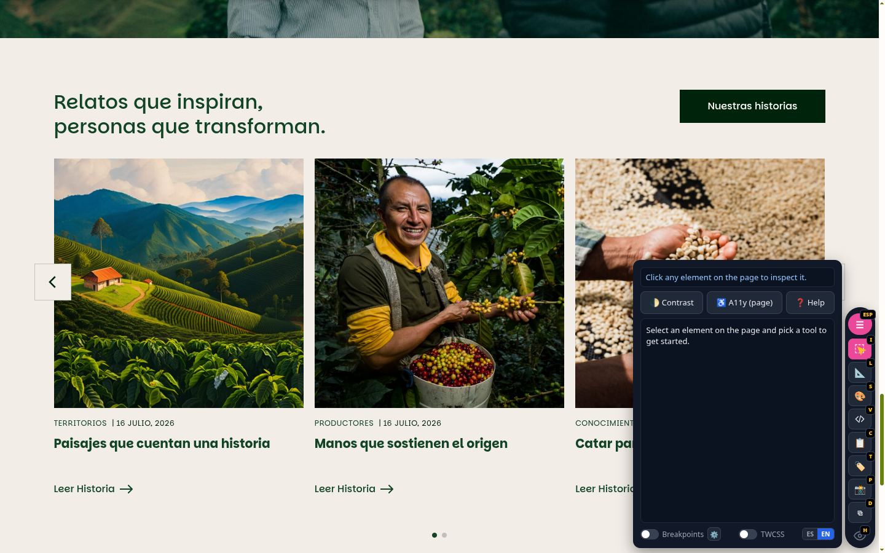

### 6.2 — Seleccionar un elemento

Con el ícono de Inspección (cursor amarillo) activado, un clic sobre cualquier elemento de la página lo selecciona: aparece un contorno punteado verde y el panel muestra su información — etiqueta, clases, y el componente/archivo al que pertenece según la convención del proyecto:

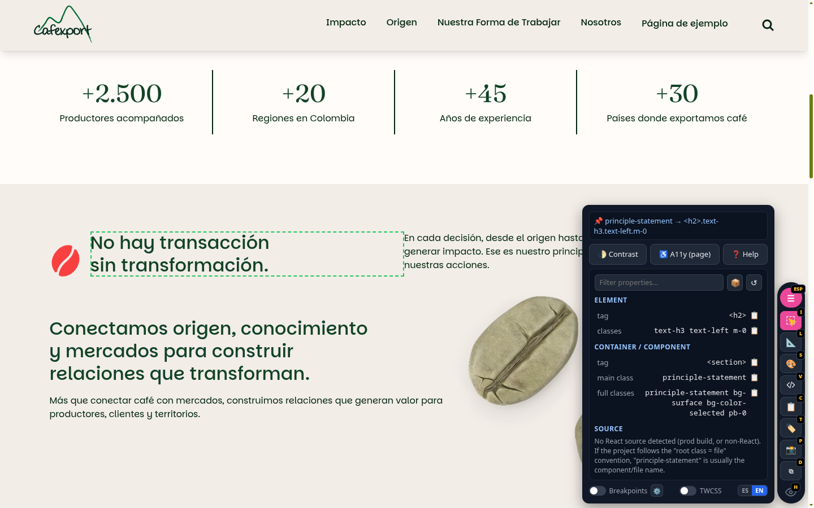

### 6.3 — Vista Estilos: tipografía y box-model completo

Con el elemento seleccionado, la vista 🎨 Estilos muestra tipografía, tamaño y el box-model completo (margin/border/padding) como diagrama visual editable, más un overlay de espaciado en la propia página:

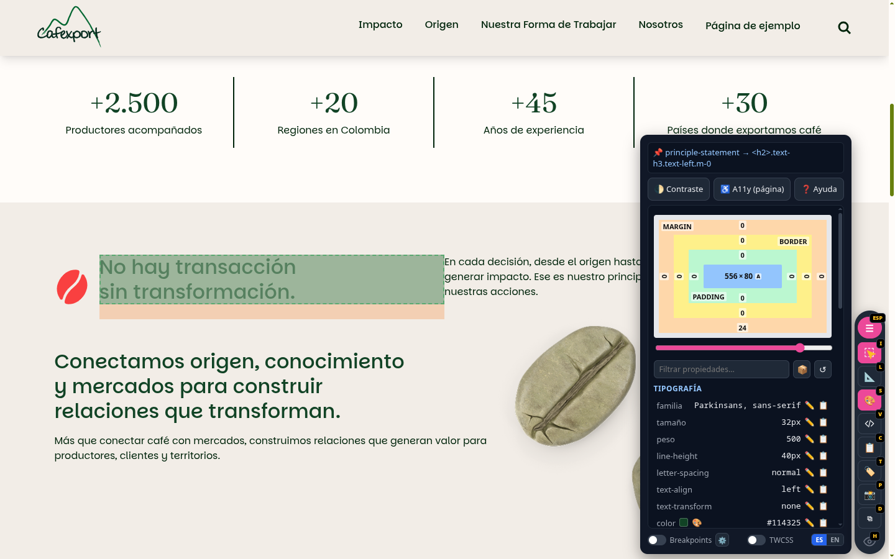

### 6.4 — Vista Layout: display, position y los overlays anidados

La vista 📐 Layout muestra la estructura de posicionamiento (flex/grid, position) con overlays de color por profundidad, y tres switches (Display / Position / Delineado) para elegir qué mostrar cuando el componente es muy denso. Cada switch tiene su propio atajo (con la vista Layout abierta): **Y** Display, **N** Position, **O** Delineado — la regla de "al menos uno activo" (Display/Position se turnan solos; Delineado no se puede apagar si es el último) aplica igual por teclado que por clic.

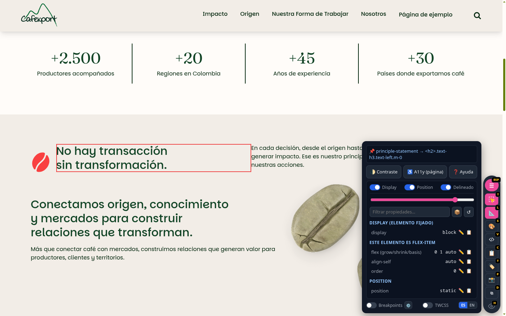

### 6.5 — `</>` Ver estructura HTML: el árbol completo, editable

El botón `</>` abre un popup con el árbol DOM completo, resaltado como un editor de código, con dos íconos por fila — un ojo (ocultar/mostrar) y una lupa (señalar sin salir del árbol) — y edición en vivo de clases y texto por nodo:

![Árbol HTML anidado, con clases Tailwind reales incluyendo basis-[30%]](assets/manual/05-arbol-html.png)

Este ejemplo es representativo a propósito: la clase `!basis-[30%]` (una fracción de Tailwind con `/` implícito en la lógica de parseo de selectores) fue justamente el caso que expuso un bug real durante el desarrollo — ver la sección 9, "Historia de bugs reales", más abajo.

### 6.6 — Ocultar elementos con cascada visual

Al ocultar un elemento con hijos (clic en su ojito), todo el bloque se atenúa en el árbol — apertura, cierre, texto interno y los ojitos de todos sus descendientes — aunque el único cambio real guardado sea el de ese elemento. En la página real, el elemento pasa a `display:none`:

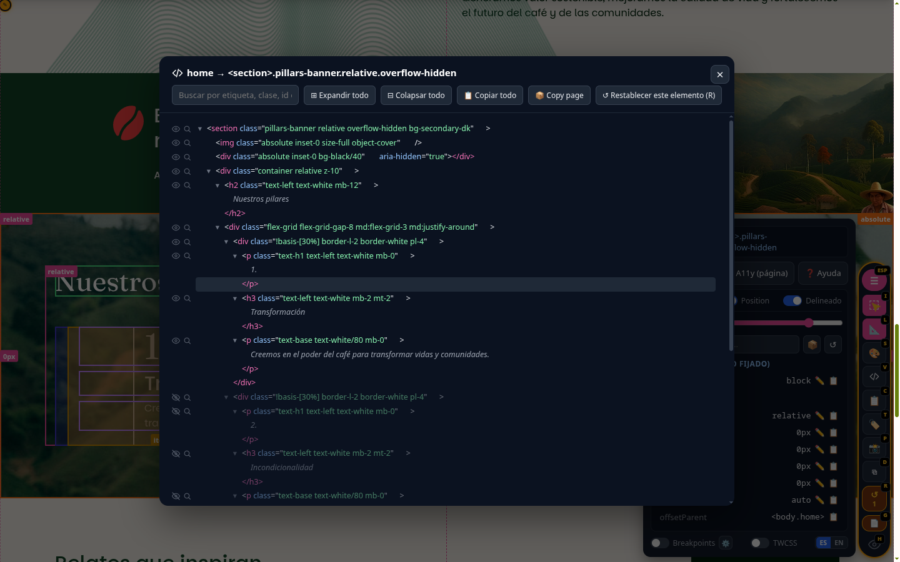

### 6.7 — Señalar sin salir del árbol (pensado para touch)

La lupa de cada fila encuadra y resalta el elemento real en la página por ∼1.8 segundos, sin cerrar el árbol ni cambiar la selección — pensada para pantallas táctiles o el emulador de dispositivo de Chrome, donde el hover (base de cualquier inspector tradicional) no existe:

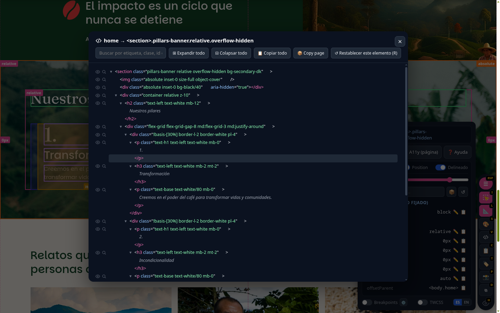

### 6.8 — Clonar un elemento

El ícono ⧉ (o tecla `D`) duplica el elemento fijado justo después del original, con marcadores numerados para deshacer selectivamente. Útil para probar cómo se ve un layout con más ítems (por ejemplo, una fila flex) sin tener que agregar contenido real todavía:

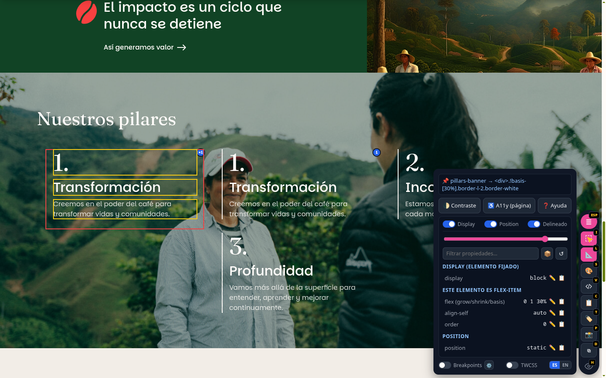

### 6.9 — Avisos de valores negativos

Cualquier valor que empiece con `-` (un margin negativo, por ejemplo) se marca con un ⚠️ junto al valor y, si la propiedad aparece en el diagrama box-model, el número correspondiente se resalta en rojo — para que un valor que puede descuadrar todo el layout no pase desapercibido:

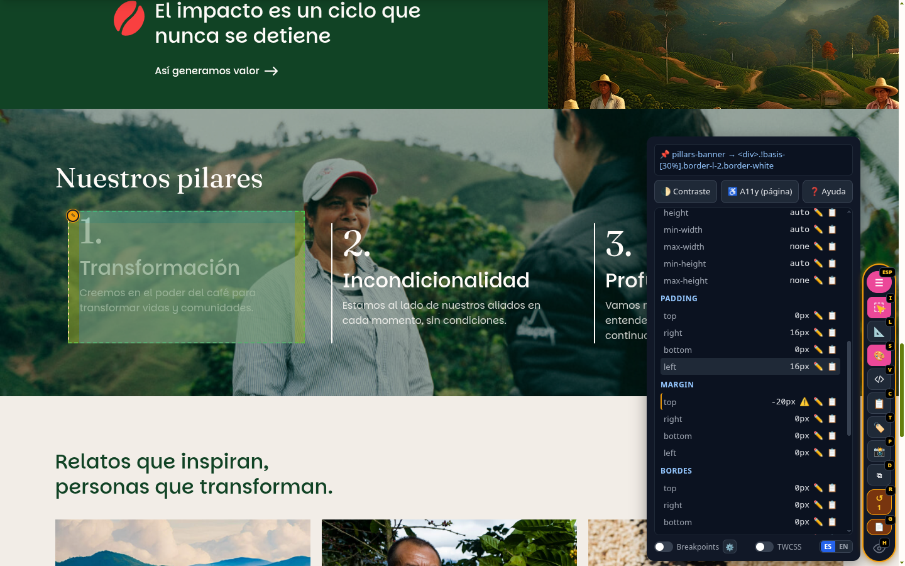

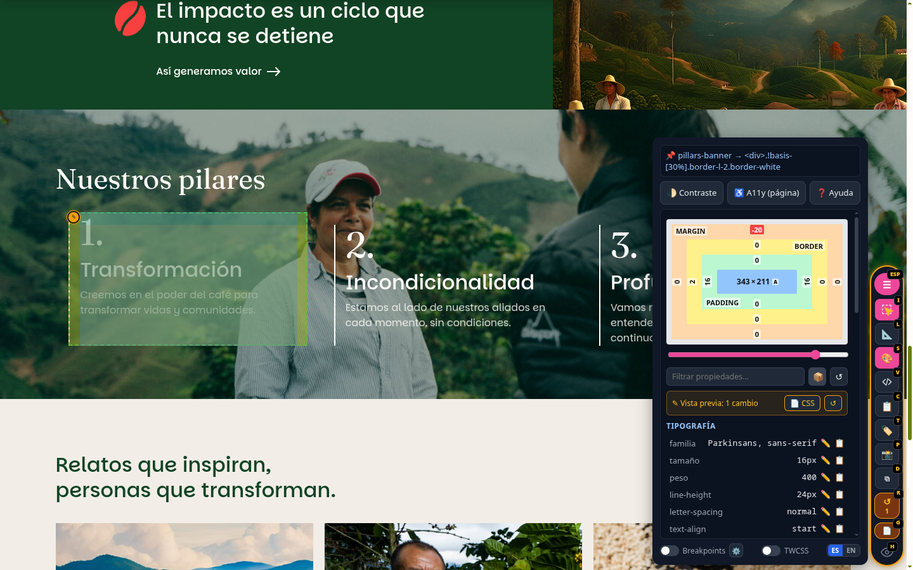

### 6.10 — Persistencia real entre recargas

Esta captura es la misma página, la misma sección, **después de un recargado completo del navegador** — la selección, la vista Layout activa, el scroll y el elemento fijado volvieron exactamente como estaban:

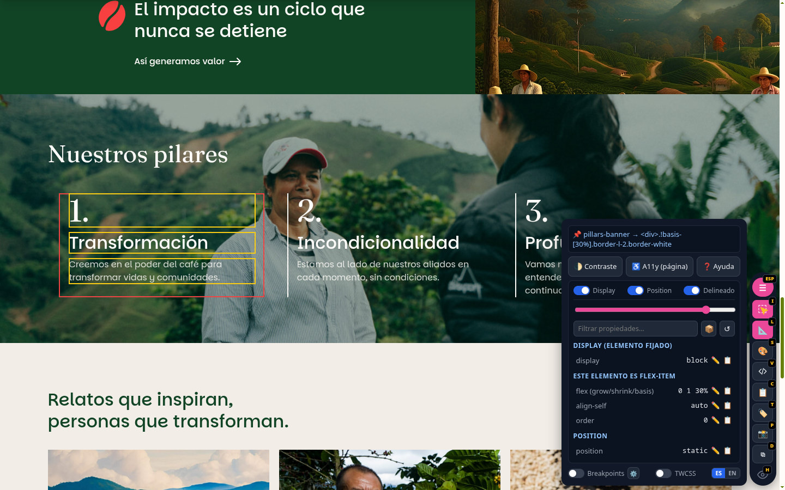

### 6.11 — Ocultar la barra sin perder el trabajo

El ícono de ojo al final de la pastilla (o tecla `H`) minimiza la fila de accesos directos — el panel grande, si estaba abierto, se mantiene visible, y un pequeño botón 🛠️ redondo queda disponible para restaurar todo con un clic:

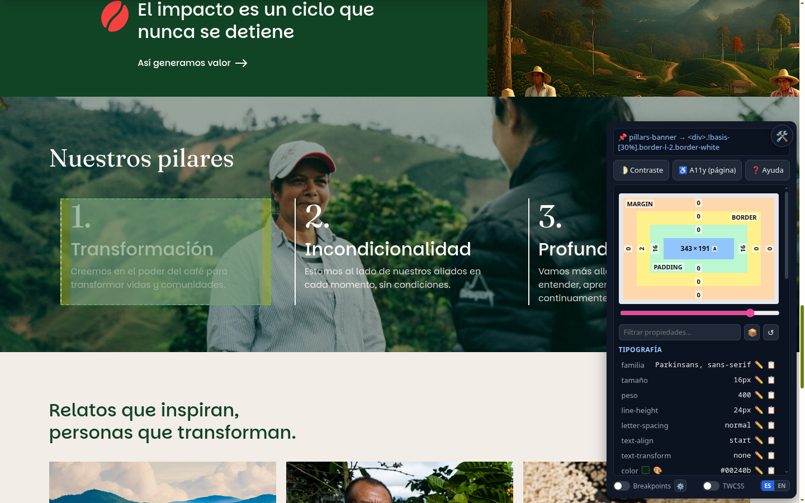

### 6.12 — Ayuda integrada

El botón ❓ Ayuda abre en cualquier momento un modal con la explicación completa de cada función, pensado para alguien que nunca vio la herramienta antes — bilingüe, igual que el resto de la interfaz:

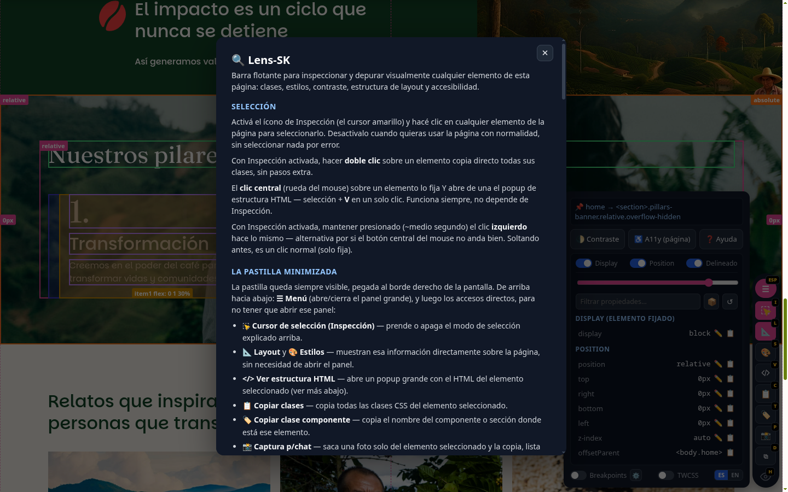

## 7. Modo live: pedir cambios reales desde el navegador (🪄 / 📤)

Todo lo descrito hasta acá es **vista previa**: vive en el DOM y en `localStorage`, nunca toca el disco. El modo live es la única puerta para que un cambio termine escrito en el archivo fuente real — y siempre a pedido explícito de un clic, nunca automático.

Cuando hay un Claude Code escuchando, aparecen dos botones nuevos junto al resumen del elemento fijado:

- **🪄 Pedir cambio** — texto libre describiendo qué querés (opcionalmente con una captura del elemento adjunta). Claude decide el valor y lo aplica como vista previa en vivo — mismo mecanismo que editar a mano con ✏️, así que queda editable después, no es definitivo todavía.
- **📤 Aplicar a archivos reales** — toma lo que esté en vista previa en ese momento (haya llegado del 🪄, de ✏️ a mano, o de una mezcla de ambos) y le pide a Claude que lo escriba en el archivo fuente real del proyecto.

Por dentro: un servidor local aparte del dev server del proyecto hace de puente — el navegador manda el pedido y se queda esperando la respuesta en el mismo `fetch()`, sin necesitar sockets ni un mecanismo de notificación aparte. Los botones **solo aparecen si hay alguien de verdad escuchando del otro lado** — si no, no se ve nada nuevo, ni siquiera un botón deshabilitado.

**Reglas de seguridad:** los cambios de archivo real nunca tocan git (no hay commit ni push automático) y nunca salen del árbol de código del proyecto — quien usa la herramienta sigue siendo quien decide cuándo llevar eso a producción.

**Requiere:** un proyecto con su propio dev server corriendo el helper (se levanta como una tarea más de `npm run dev`), y una sesión de Claude Code activa escuchando ese helper. Sin eso, la herramienta sigue funcionando exactamente igual que sin este modo — es una capa opcional encima, no una dependencia nueva.

**Asistencia Claude hereda el overlay de la vista anterior:** activar 🤖 Asistencia Claude no es una vista con su propio overlay — muestra el mismo overlay de página que tenías activo justo antes (la grilla/etiquetas de 📐 Layout, o el margin/border/padding de 🎨 Estilos), y lo sigue actualizando en vivo mientras escribís el pedido: si scrolleás la página, el overlay se mueve con el elemento, exactamente como si esa vista siguiera abierta. Así podés seguir viendo la referencia visual (la grilla, el box-model) mientras le pedís el cambio a Claude, en vez de que se limpie la pantalla apenas abrís el panel de Asistencia. Si la última vista era Componente, Contraste o A11y (sin overlay propio), Asistencia tampoco muestra ninguno.

### 7.1 — Dos vías, dos fuentes distintas para los colores del proyecto

La herramienta se puede usar de dos formas — como módulo Node normal (sin IA) o junto a una sesión de Claude Code con modo-ia activo — y cada una resuelve los `--color-*` del proyecto desde un lugar distinto:

| | Módulo Node normal (sin IA) | Skill con modo-ia (con IA) |
|---|---|---|
| Fuente de colores | `getProjectColorVariables()` — infiere los `--color-*` leyendo las reglas `:root`/`:host` del CSS **ya cargado en la página** (el `<link rel="stylesheet">` del theme compilado) | `colorTokens` en `project-map.json` — leído directo de la **fuente** (los plugins `tailwindcss/plugins/*.js` del proyecto, ej. `variables.js`), antes de compilar |
| Cuándo se usa | Siempre, para el picker 🎨/dropdown de variables del panel Estilos | Solo cuando Claude necesita el hex real para responder un pedido live |
| Requiere Node/servidor | No — funciona con la herramienta sola, inyectada en cualquier página | Sí (el helper del modo live + el generador del mapa del proyecto) |

Matiz real: la vía sin IA lee el **compilado**, así que puede ir un paso atrás de la paleta si alguien editó el archivo fuente de variables y todavía no corrió el build — aceptable ahí, porque es lo único a lo que un script corriendo solo en el navegador tiene acceso. La vía con IA sí tiene que usar siempre la fuente, nunca el compilado, para no arrastrar ese mismo desfasaje.

## 8. Ejemplos prácticos de uso

**Ajustar el padding de una tarjeta hasta que se vea bien, y llevarlo al código:**
1. Activar Inspección, hacer clic en la tarjeta.
2. Abrir 🎨 Estilos, tocar el valor de `padding` en el diagrama box-model varias veces hasta que se vea bien.
3. Cuando convence, click en 📄 (o `G`) para copiar el CSS real (selector + la propiedad cambiada) y pegarlo en el archivo fuente.
4. `R` para deshacer la vista previa una vez que el cambio ya está en el código — no hace falta, pero mantiene la sesión limpia para el siguiente ajuste.

**Ver cómo se comporta un layout flex con un ítem más, sin tocar el CMS/base de datos:**
1. Seleccionar uno de los ítems de la fila.
2. `D` (Clonar) para agregar una copia después del original.
3. Ajustar lo que haga falta en el clon o en el original.
4. Clic en el marcador ×N del original para deshacer todos los clones cuando se terminó de probar.

**Depurar en el emulador de dispositivo de Chrome (sin mouse real):**
1. Activar el emulador de dispositivo/touch en DevTools.
2. Abrir `</>` Ver estructura HTML sobre el elemento de interés.
3. Usar la lupa de cada fila para ubicar visualmente cada nodo sin perder el árbol abierto — sin depender de ningún hover, que en modo touch no dispara.

**Ocultar temporalmente un bloque para ver el layout sin él, sin borrar nada:**
1. Abrir `</>` Ver estructura HTML.
2. Clic en el ojito del bloque en cuestión — se oculta (`display:none`) junto con toda su cascada visual en el árbol.
3. Clic de nuevo para restaurarlo, o `R` para deshacer todos los cambios de la página de una vez.

## 9. Historia de bugs reales (por qué esto importa para confiar en la herramienta)

Vale la pena documentar algunos de los bugs encontrados y corregidos durante el desarrollo, porque explican decisiones de diseño que de otra forma parecerían arbitrarias:

- **Clases de Tailwind con fracciones (`basis-1/2`, `w-1/3`) rompían los indicadores de modificación/clonado.** El selector CSS armado internamente concatenaba las clases sin escapar el `/`, que es inválido en un selector CSS sin escapar — `querySelectorAll` fallaba en silencio y el indicador simplemente no aparecía. Se corrigió escapando cada clase con `CSS.escape()`. La lección: cualquier proyecto con Tailwind (que usa fracciones todo el tiempo para layouts de columnas) depende de este fix para que los indicadores funcionen de forma consistente.
- **El scroll "instantáneo" no lo era, si la página tenía `scroll-behavior:smooth` en el CSS.** La función de "señalar" y de "seleccionar y resaltar" pedían un scroll con `behavior:'auto'`, asumiendo que eso significa "sin animación" — pero la especificación real es "respetá el `scroll-behavior` de la página", así que en cualquier sitio con scroll suave configurado (común, para anclas), el marco de resaltado se dibujaba en la posición de ANTES de terminar de scrollear. Se corrigió forzando `scroll-behavior:auto` inline justo antes del scroll, y restaurándolo después.
- **Ocultar un elemento con hijos no atenuaba visualmente toda su descendencia en el árbol.** El primer diseño solo marcaba como "oculto" la fila clickeada; los hijos ya renderizados no se enteraban del cambio. Se corrigió con un mecanismo que recalcula el estado de opacidad de **todas** las filas visibles del árbol cada vez que se toca cualquier ojito, sin por eso crear overrides redundantes para cada hijo — el único cambio real guardado sigue siendo el del elemento que se clickeó.

Estos tres bugs comparten un patrón: son el tipo de problema que solo aparece con datos reales de un proyecto en producción (clases de Tailwind reales, CSS real de scroll suave, estructuras HTML anidadas reales) — no con casos de prueba sintéticos. Esta primera versión fue validada directamente contra una página real en producción, no contra un sandbox artificial.

## 10. Limitaciones honestas

- El chequeo de accesibilidad es un escaneo rápido, no reemplaza axe-core ni Lighthouse.
- El diagrama box-model es esquemático (grosor fijo) — solo el número de texto es el valor real.
- La sección Hover de Estilos es una aproximación por selector, no la cascada real que resuelve el navegador.
- La traducción a "archivo/componente de origen" real (no solo por convención de nombre) solo funciona en React con build de desarrollo.
- La persistencia depende de que el selector CSS interno siga resolviendo al mismo elemento — si la estructura HTML cambió entre recargas, el override simplemente no se aplica (no falla ruidosamente, pero tampoco avisa).

## 11. Qué viene después: ideas para el futuro

Esta primera versión vive como skill de Claude Code, pensada para inyectarse vía el MCP de Chrome DevTools en cualquier proyecto. El siguiente paso evaluado es reempaquetarla como paquete de npm (`lens-sk`), instalable como `devDependency` y auto-inyectada por un plugin de build (Vite/webpack) — siguiendo el modelo de distribución ya validado por herramientas como `react-scan` o `vite-plugin-vue-devtools`, pero apuntando a un hueco de mercado que ningún competidor cubre hoy: ser agnóstica de framework (funciona igual en WordPress/PHP renderizado, HTML estático, React o Vue) y tener edición visual de CSS con conciencia real de Tailwind — algo que ni las herramientas de "puente hacia IA" (stagewise) ni los editores visuales existentes (VisBug, CSS Scan) combinan hoy.

Lo que sigue son notas de una exploración técnica sobre el modo live — **todavía no construido**, para retomar en una futura actualización.

### Extensión de VSCode como alternativa (o complemento) al modo live

Se evaluó si el puente navegador↔editor se podría hacer con una extensión de VSCode en vez de (o además de) una sesión de Claude Code escuchando el helper. Dos variantes posibles, sin decidir todavía cuál:

1. **Con IA igual, pero embebida en la extensión** — llamando directo a la API de Claude con una key propia, sin necesitar una sesión de Claude Code abierta en la terminal.
2. **Sin IA, supervisado por quien desarrolla** — la extensión arma un diff del cambio pedido y lo muestra para aceptar/rechazar con un clic (como una sugerencia de autocompletado), sin que ningún modelo decida nada — el criterio queda en manos de la persona.

### El problema de fondo de la opción sin IA: clases que no llegan "tal cual" a la página

Si el archivo fuente construye las clases por variables (PHP con condicionales, `clsx`/`classnames`, CSS Modules con hash, css-in-js), el string que se ve en el navegador no tiene correspondencia literal con ningún string fijo del código — es el *resultado* de una lógica, no una copia de ella. Ahí un tool determinístico solo puede:

- **Resolverlo sin ambigüedad** cuando el framework expone su propia instrumentación de desarrollo (el `_debugSource` de React, el equivalente de Vue) — no depende de las clases en absoluto, pregunta directo "¿qué componente/línea renderizó esto?". Lens-SK ya usa esto parcialmente (ver "Consciente del proyecto", sección 2).
- **Acotar candidatos, nunca dar una respuesta única**, cuando esa instrumentación no existe — buscando por texto los fragmentos literales que sí aparecen en el código, y dejando que alguien (persona o modelo) elija entre las coincidencias.

Esto define qué tan lejos puede llegar una versión sin IA del modo live: gratis en React/Vue en modo desarrollo, pero "elegí vos entre estas opciones" en todo lo demás — no hay forma de evitar ese paso sin meter algo que entienda semántica.
